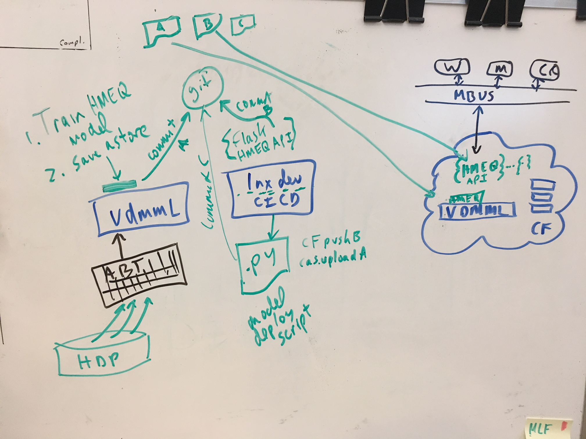

# SAS Viya Model Publishing Exploration

Using the Python for API for SAS Viya Data Mining and Machine Learning:
1. Train a Gradient Boosting model and save the model's state ('savestate') as the portable Analytic store formate (astore). 
2. Move the model's astore to another SAS Viya envionment and expose the model description, inputs, and outputs via REST API to allow for fast single record scoring against the saved model.

Roughly as in the following:

Requirements:
* SAS Viya Data Mining and Machine Learning
* Python-SWAT package for accessing SAS
* Python packages: Pandas, numpy, Flask, json
